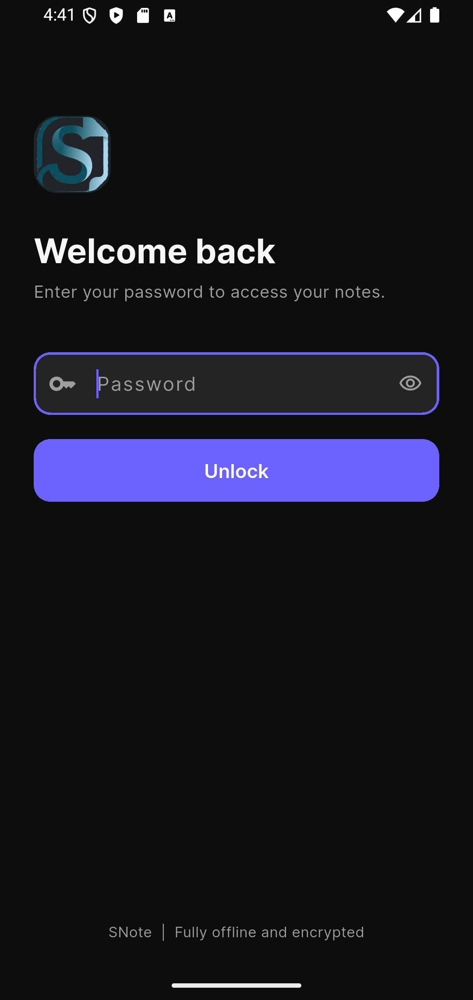
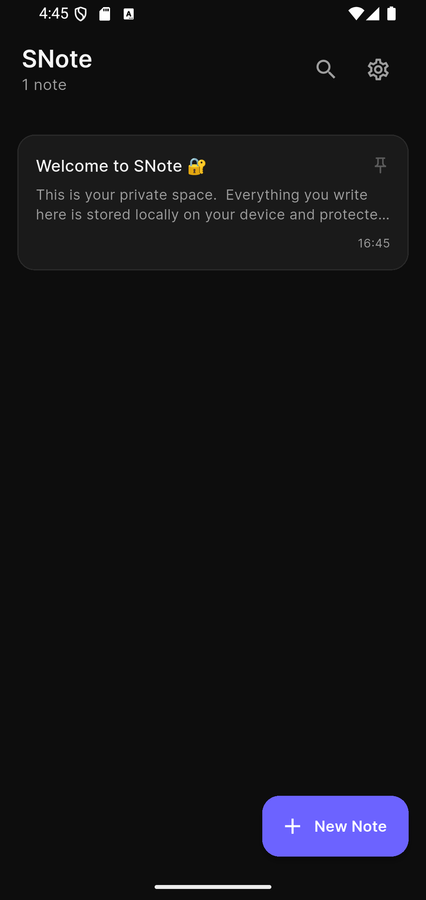
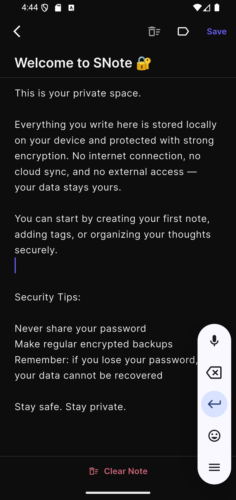
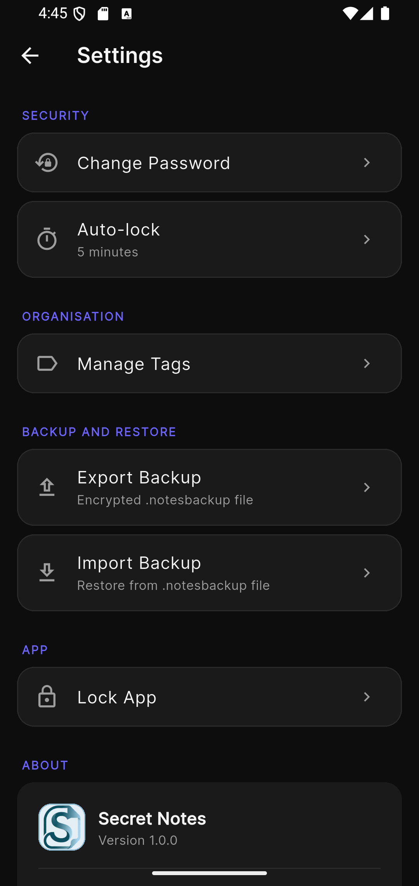

<div align="center">


<br><br>

# SNote — Private Encrypted Notes

**A production-grade, fully offline notes application with AES-256 encryption,
biometric authentication, and root/jailbreak detection.**

*Every note is encrypted before it touches storage. No cloud. No accounts. No tracking.*

</div>

---

## Table of Contents

- [Overview](#overview)
- [Screenshots](#screenshots)
- [Features](#features)
- [Security Architecture](#security-architecture)
- [Tech Stack](#tech-stack)
- [Project Structure](#project-structure)
- [Installation and Setup](#installation-and-setup)
- [Usage](#usage)
- [Configuration](#configuration)
- [Contributing](#contributing)
- [License](#license)
- [Author](#author)

---

## Overview

SNote is a security-first private notebook for Android and iOS. It was built
on the premise that note-taking applications should not require an account,
should never transmit data over the network, and should protect content
with real cryptography — not just a PIN lock over plaintext storage.

All notes are encrypted with AES-256-CBC before being written to disk. The
encryption key is never stored directly: it is derived from the user's password
using PBKDF2-HMAC-SHA256 (100,000 iterations), and each individual note uses a
further unique key derived via HKDF-SHA256 from a random per-note salt. Editing
a note rotates its salt and therefore all of its keys.

The application runs entirely offline. There is no internet permission in the
manifest. There are no analytics, no crash-reporting SDKs, and no third-party
telemetry of any kind.

---

## Screenshots

> Screenshots will be added with the first public release.
> The interface follows a dark-only Material 3 design language.

| Login | Notes List | Editor | Settings |
|:---:|:---:|:---:|:---:|
|  |   |   |   |

---

## Features

### Notes
- Create, edit, and delete notes with title and freeform content
- Pin notes to keep them at the top of the list
- Multi-select mode (long-press) with batch permanent delete
- Swipe left to delete a single note
- Assign colour-coded tags to notes and filter by tag
- Full-text search across title and content (entirely offline)
- "Clear Note" button with confirmation to wipe a note's content without deleting it
- Auto-discard of empty notes — no blank records ever enter storage
- Unsaved-change detection on exit: Save / Discard / Cancel prompt

### Security
- AES-256-CBC encryption with a random IV on every encrypt call
- PBKDF2-HMAC-SHA256 master key derivation (100,000 iterations)
- HKDF-SHA256 per-note key derivation with unique salts
- Key rotation on every note save (fresh salt = new keys)
- Title and content encrypted with separate HKDF context labels
- Master key lives in memory only — never written to disk
- Hive database encrypted with a separate AES-256 key (two independent layers)
- `flutter_secure_storage` backed by Android EncryptedSharedPreferences / iOS Keychain
- Biometric unlock (fingerprint, Face ID) with secure master-key caching
- Password-based unlock with configurable failed-attempt lockout (default: 5)
- Auto-lock after configurable inactivity period (1 – 30 minutes, or disabled)
- Screenshot and screen-recording blocked via `FLAG_SECURE` (Android)
- Paste-only clipboard policy on all text fields — Copy and Cut are disabled
- Root detection (Android): 6-layer native Kotlin check covering build
  integrity, su binaries, root package scan, mount analysis, command probing,
  and Magisk hidden paths
- Jailbreak detection (iOS): file-system scan for Cydia, MobileSubstrate, SSH,
  and common jailbreak artefacts
- Non-dismissible blocking screen with 10-second auto-exit on compromised devices
- `allowBackup: false` in the manifest — no ADB or cloud backup of sensitive data

### Backup and Restore
- Export an encrypted `.notesbackup` file — the entire payload is AES-encrypted
  with a throw-away HKDF key before being written to disk
- Import and restore from any `.notesbackup` file
- Backup integrity is validated during import; a wrong password fails cleanly

### Organisation
- Create and colour-code tags (8 preset colours)
- Filter the note list by tag
- Sort: pinned notes first, then by last-modified descending

---

## Security Architecture

```
Password
  │
  └─ PBKDF2-HMAC-SHA256 (100,000 iterations, 32-byte random salt)
       │
       └─ 256-bit Master Key  [memory only, wiped on lock]
             │
             ├─ HKDF-SHA256 (noteSalt + context="snote-title-v1")
             │     └─ 256-bit Title Key  → AES-256-CBC (random IV per call)
             │
             └─ HKDF-SHA256 (noteSalt + context="snote-content-v1")
                   └─ 256-bit Content Key → AES-256-CBC (random IV per call)

noteSalt = 32 cryptographically secure random bytes, regenerated on every save.
The Hive database itself is additionally encrypted with an independent AES key
stored in flutter_secure_storage (Android Keystore / iOS Secure Enclave).
```

### Root Detection Layers (Android)

| Layer | Method | Catches |
|---|---|---|
| 1 | Build integrity (`ro.debuggable`, `ro.secure`, `test-keys`, build type) | Engineering builds, ADB root |
| 2 | su binary scan (32 paths) | SuperSU, Magisk, KernelSU, legacy root |
| 3 | Root package scan (30 packages) via PackageManager | Root managers, Xposed, Substrate |
| 4 | `/proc/self/mountinfo` analysis | rw-mounted `/system` or `/vendor` |
| 5 | Command probe (`which su`, `su -c id`) | Active su in PATH |
| 6 | Magisk hidden mount scan (`/sbin` enumeration) | Modern Magisk tmpfs overlay |

The native check runs **before the Flutter engine initialises**, meaning no
encrypted storage is opened and no keys are loaded if root is detected.

---

## Tech Stack

| Category | Package | Version |
|---|---|---|
| Framework | Flutter | 3.22+ |
| Language | Dart | 3.3+ |
| State management | flutter_riverpod | 2.5.1 |
| Database | hive / hive_flutter | 2.2.3 / 1.1.0 |
| Secure storage | flutter_secure_storage | 9.2.2 |
| Encryption (AES) | encrypt | 5.0.3 |
| Hashing (SHA, PBKDF2) | crypto | 3.0.3 |
| Key derivation (HKDF) | cryptography | 2.7.0 |
| Biometrics | local_auth | 2.3.0 |
| Fonts | google_fonts | 6.2.1 |
| Animations | flutter_staggered_animations | 1.1.1 |
| File sharing | share_plus | 9.0.0 |
| File picking | file_picker | 8.1.3 |
| Code generation | hive_generator + build_runner | 2.0.1 / 2.4.13 |
| Native (Android) | Kotlin 1.9.23, AGP 8.3.2, Gradle 8.6 |  |
| Min SDK | Android 6.0 (API 23) | |
| Target SDK | Android 15 (API 35) | |

---

## Project Structure

```
snote/
├── pubspec.yaml
│
├── android/
│   ├── settings.gradle.kts
│   ├── build.gradle.kts
│   ├── gradle/wrapper/gradle-wrapper.properties
│   └── app/
│       ├── build.gradle.kts
│       ├── proguard-rules.pro
│       └── src/main/
│           ├── AndroidManifest.xml
│           ├── res/values/styles.xml
│           └── kotlin/com/mazen/snote/
│               ├── MainActivity.kt          # FLAG_SECURE, native root gate
│               ├── RootDetectionHelper.kt   # 6-layer root detection engine
│               └── RootDetectionChannel.kt  # MethodChannel bridge to Dart
│
└── lib/
    ├── main.dart                            # Entry point, root check, Hive init
    │
    ├── core/
    │   ├── encryption/
    │   │   ├── encryption_service.dart      # AES-256-CBC, per-note IV
    │   │   └── key_derivation_service.dart  # PBKDF2, HKDF, salt generation
    │   ├── security/
    │   │   ├── security_service.dart        # Auth, biometrics, auto-lock
    │   │   ├── root_detection_service.dart  # Dart-layer 3-layer check
    │   │   └── screen_security_service.dart # Screenshot protection hook
    │   ├── storage/
    │   │   └── hive_storage.dart            # Encrypted Hive box init
    │   └── theme/
    │       └── app_theme.dart              # Material 3 dark theme tokens
    │
    ├── features/
    │   ├── auth/
    │   │   ├── login_page.dart
    │   │   ├── setup_password_page.dart
    │   │   └── compromised_device_page.dart # Non-dismissible root block
    │   ├── notes/
    │   │   ├── note_model.dart              # Hive model + NoteView (in-memory)
    │   │   ├── note_model.g.dart            # Hive adapter (9 fields)
    │   │   ├── notes_repository.dart        # CRUD, search, backup/restore
    │   │   ├── notes_page.dart              # Home screen, multi-select delete
    │   │   └── edit_note_page.dart          # Editor with snapshot-based save detection
    │   └── settings/
    │       └── settings_page.dart           # Security, tags, backup, developer info
    │
    └── widgets/
        ├── note_card.dart                   # Dismissible card, selection overlay
        └── secure_text_field.dart           # Paste-only context menu, obscure toggle
```

---

## Installation and Setup

### Prerequisites

| Requirement | Minimum version |
|---|---|
| Flutter | 3.22.0 |
| Dart | 3.3.0 |
| Java / JDK | 17 |
| Android SDK | API 35 |
| Gradle | 8.6 (managed by wrapper) |
| Xcode (iOS builds) | 15.0 |

### 1. Clone the repository

```bash
git clone https://github.com/Mazen657/snote.git
cd snote
```

### 2. Install Flutter dependencies

```bash
flutter pub get
```

### 3. Generate Hive adapters

The repository ships with a hand-written adapter stub (`note_model.g.dart`) that
is kept in sync with `note_model.dart`. To regenerate from source after any
model change:

```bash
dart run build_runner build --delete-conflicting-outputs
```

### 4. Run on a connected device or emulator

```bash
# Debug build
flutter run

# Release build (APK)
flutter build apk --release

# Release build (App Bundle for Play Store)
flutter build appbundle --release
```

> **Note:** Root detection is active in every build type, including debug.
> Use a non-rooted physical device or an unmodified emulator for development.
> A rooted emulator will display the security block screen and exit.

### 5. iOS setup (macOS only)

```bash
cd ios
pod install
cd ..
flutter run
```

Ensure the iOS deployment target in `ios/Podfile` is set to 13.0 or later to
satisfy `local_auth` and `flutter_secure_storage` requirements.

---

## Usage

### First launch

On the first launch SNote displays the **Set up your password** screen. Enter
a password of at least 6 characters and confirm it.

> **Important:** There is no password-reset mechanism. If you forget your
> password your notes cannot be recovered. This is by design — recovery
> mechanisms are attack surfaces.

### Creating a note

Tap the **New Note** button on the home screen. Enter a title and content.
Tap **Save** to persist the note, or use the back button — if you have typed
anything you will be prompted to Save, Discard, or Cancel.

### Multi-select delete

Long-press any note card to enter selection mode. Tap additional cards to add
them to the selection. Tap the bin icon in the header to permanently delete
all selected notes. Deletion is immediate and irreversible.

### Tags

Open **Settings → Manage Tags** to create colour-coded tags. In the editor
tap the label icon in the app bar to assign tags. Filter by tag from the home
screen chip row.

### Backup and restore

Open **Settings → Export Backup** to share an encrypted `.notesbackup` file.
Open **Settings → Import Backup** and select a `.notesbackup` file to restore.
The backup is encrypted with your current master key; it can only be decrypted
by an installation that knows the same password.

### Biometric unlock

Enable in **Settings → Biometric Unlock**. After enabling, the master key is
cached in `flutter_secure_storage` (Android Keystore / iOS Secure Enclave).
Subsequent logins present a biometric prompt. The password remains as a fallback.

### Auto-lock

Configure in **Settings → Auto-lock**. When the timer fires, the master key is
wiped from memory and the login screen is shown. Choices: 1 min, 2 min, 5 min,
10 min, 30 min, or Disabled.

---

## Configuration

SNote has no configuration files or environment variables. All user preferences
(auto-lock duration, biometric enabled state) are stored in `flutter_secure_storage`
and are device-specific.

### Changing the application ID

Edit `android/app/build.gradle.kts`:

```kotlin
defaultConfig {
    applicationId = "com.yourcompany.snote"
    // ...
}
```

Update the package in `android/app/src/main/kotlin/` and in
`AndroidManifest.xml` to match.

### Adjusting PBKDF2 iterations

Edit `lib/core/encryption/key_derivation_service.dart`:

```dart
static const int _pbkdf2Iterations = 100000; // increase for stronger security
```

Higher values increase resistance to brute-force attacks but also increase
the time the login screen takes to unlock. 100,000 is the NIST-recommended
minimum for PBKDF2-HMAC-SHA256 as of 2023.

### Adjusting the failed-attempt limit

Edit `lib/core/security/security_service.dart`, key `snote_max_attempts`.
The default is 5. After the limit is reached the app enters a locked state
that cannot be bypassed without reinstalling.

---

## Contributing

Contributions are welcome. Please follow the process below.

### Reporting bugs

Open an issue with the label `bug`. Include:
- Flutter version (`flutter --version`)
- Device model and Android/iOS version
- Steps to reproduce
- Expected vs actual behaviour

Do **not** include real notes, passwords, or any personal data in bug reports.

### Submitting a pull request

1. Fork the repository.
2. Create a feature branch from `main`:
   ```bash
   git checkout -b feature/your-feature-name
   ```
3. Make your changes. Ensure `flutter analyze` produces no warnings.
4. Run the test suite:
   ```bash
   flutter test
   ```
5. Commit with a clear message:
   ```bash
   git commit -m "feat: short description of change"
   ```
6. Push and open a pull request against `main`.

### Code style

- Follow the [Dart style guide](https://dart.dev/guides/language/effective-dart/style).
- Run `dart format .` before committing.
- Security-related code must include a comment explaining the threat model it addresses.
- New dependencies require justification in the PR description.

### Security vulnerabilities

Do **not** open a public issue for security vulnerabilities. Send a private
report to the email address in the [Author](#author) section. Allow 14 days
for an initial response before any public disclosure.

---

## Author

**Mazen Abdallah**

| | |
|---|---|
| GitHub | [github.com/Mazen657](https://github.com/Mazen657) |
| LinkedIn | [linkedin.com/in/mazen-abdallah-mohamed](https://www.linkedin.com/in/mazen-abdallah-mohamed/) |

---

<div align="center">

Built with a security-first mindset. No accounts. No cloud. No compromise.

</div>
